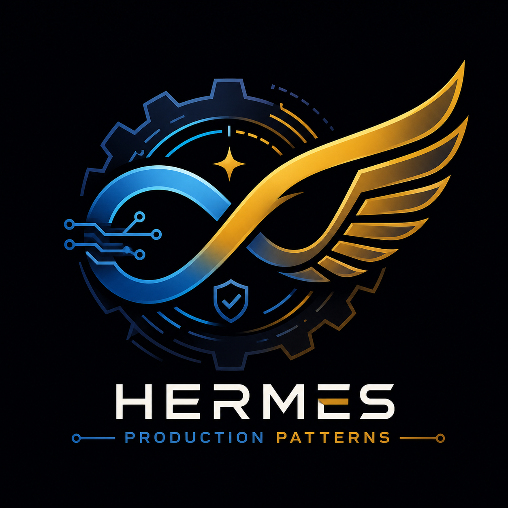

# Hermes Production Patterns

<p align="center">
  <picture>
    <source media="(prefers-color-scheme: dark)" srcset="assets/logo.png">
    
  </picture>
</p>

<p align="center">
  <a href="https://github.com/Komagon/hermes-production-patterns/actions/workflows/ci.yml">
    
  </a>
  <a href="LICENSE">
    
  </a>
</p>

> **Production-grade engineering patterns for [Hermes Agent](https://github.com/NousResearch/hermes-agent)**  
> Built on Harness Engineering methodology + Loop Engineering + [12-Factor Agents](https://github.com/humanlayer/12-factor-agents)

---

## 📖 Introduction

**Hermes Production Patterns** is a collection of engineering conventions, templates, and scripts that turn Hermes Agent from a chat toy into a 7×24 autonomous production system.

You've installed Hermes. Now what? If you're struggling with:

- Writing reliable Skills that don't drift over time
- Cron jobs that silently produce garbage instead of failing loudly
- Agent output quality that requires constant human babysitting
- Task state that evaporates the moment the session ends
- Error traces that flood the context window and derail the agent

This project is for you.

These aren't armchair best practices — every pattern here has been **battle-tested in real 7×24 production runs**, broken, fixed, and hardened into reusable conventions.

> 🇨🇳 [中文版](README.md) also available.

---

## Why This Project

The Hermes community is full of "how to install" guides, but there's almost nothing about "how to run it reliably in production." This project fills that gap by providing:

| Problem | Solution |
|:---|:---|
| Skills drift and degrade over time | `conventions/skill-evolution.md` — systematic ADD/DELETE/REPLACE cycle |
| No separation between generation and verification | `conventions/maker-checker.md` — two independent agents |
| Task state lost between sessions | `conventions/state-file-pattern.md` — STATE.md with atomic writes |
| LLM calls used for everything (expensive) | `conventions/control-flow-separation.md` — code for known paths, LLM for decisions |
| Raw errors flood agent context | `conventions/error-compact-pattern.md` — compacted, categorized, actionable |
| No maturity progression for new automations | `patterns/maturity-staging-l1-l2-l3.md` — L1 report → L2 assisted → L3 autonomous |

---

## Project Structure

```
hermes-production-patterns/
├── AGENTS.md                    ← Harness entry point (AI, read me)
├── README.md                    ← Chinese documentation
├── README.en.md                 ← English documentation (this file)
├── LICENSE                      ← MIT
├── config.yaml.example          ← Hermes config template (sanitized)
│
├── conventions/                 ← 5 engineering conventions
│   ├── maker-checker.md         — Generate / verify role separation
│   ├── state-file-pattern.md    — STATE.md cross-run state management
│   ├── control-flow-separation.md — Deterministic vs. stochastic routing
│   ├── error-compact-pattern.md — Compact errors, preserve context
│   └── skill-evolution.md       — ADD / DELETE / REPLACE skill refinement
│
├── templates/                   ← Reusable file templates
│   ├── SKILL.md.template
│   ├── STATE.md.template
│   └── AGENTS.md.template
│
├── patterns/                    ← Design patterns & methodology
│   ├── loop-engineering-14-steps.md       — From prompter to loop designer
│   ├── 12-factor-agents-for-hermes.md     — 12 principles mapped to Hermes
│   └── maturity-staging-l1-l2-l3.md       — L1→L2→L3 rollout protocol
│
├── examples/                    ← Runnable examples
│   ├── daily-news-digest/       — SKILL.md + STATE.md + test_example.py
│   ├── cron-safety/             — Cron + safety integration walkthrough
│   └── maker-checker-pipeline/  — Article production pipeline demo
│
├── scripts/                     ← Validation & automation
│   ├── validate_state.py        — STATE.md schema compliance checker
│   ├── atomic_state_write.py    — Atomic writes with file locking
│   └── check_maturity.py        — L1→L2→L3 checklist runner (JSON output)
│
└── ARCHITECTURE.md              — System architecture, data flow, observability
```

---

## Three Design Principles

### 1. Harness Engineering — The Repository is the Source of Truth

The repo itself is a Harness Engineering case study. `AGENTS.md` is the entry point for any AI reading your project. Each `conventions/` file is an executable skill. Templates are instantiable prototypes.

### 2. Loop Engineering — From Prompts to Systems

Don't hand-write every prompt. Design an **autonomous loop** that discovers work → dispatches it to the agent → verifies the result → records state → decides next move.

### 3. 12-Factor Agents — Reliability by Design

Each engineering principle maps to a concrete decision:

| Factor | Convention |
|:---:|:---|
| 2 — Own your prompts | Write SKILL.md, not ad-hoc prompts |
| 5 — Unify state | STATE.md with atomic writes + file locking |
| 7 — Human-in-loop | Maker/Checker dual-role separation |
| 8 — Own control flow | Deterministic code paths + LLM paths, separate |
| 9 — Compact errors | Categorized, compressed, recoverable |

---

## Quick Start

```bash
git clone https://github.com/Komagon/hermes-production-patterns.git
cd hermes-production-patterns
```

**Copy conventions to your Hermes skills directory:**

```bash
# ── Linux / macOS ──
mkdir -p ~/.hermes/skills/conventions
cp conventions/* ~/.hermes/skills/conventions/

# ── Windows (PowerShell) ──
New-Item -ItemType Directory -Force -Path "$env:USERPROFILE\AppData\Local\hermes\skills\conventions"
Copy-Item -Path conventions\* -Destination "$env:USERPROFILE\AppData\Local\hermes\skills\conventions\"
```

**Create your first Skill from a template:**

```bash
# Unix
cp templates/SKILL.md.template ~/.hermes/skills/my-skill/SKILL.md
```

**Add STATE.md to a cron job:**

```bash
cp templates/STATE.md.template reports/my-cron-job/STATE.md
```

**Configure Hermes:**

```bash
cp config.yaml.example ~/.hermes/config.yaml
# Replace YOUR_xxx_HERE with your actual API keys
```

---

## Environment Variables

| Variable | Purpose | Required |
|:---|:---|:---:|
| `HERMES_API_KEY` | Hermes API authentication | Yes |
| `OPENAI_API_KEY` / `ANTHROPIC_API_KEY` | LLM provider | Depends on provider |
| `FAL_KEY` | Image generation (FAL.ai) | Optional |
| `MINERU_API_KEY` | PDF parsing (MinerU) | Optional |
| `GITHUB_TOKEN` | GitHub API operations | Optional (auto-injected in CI) |

```bash
# Unix / macOS
export HERMES_API_KEY="your-key-here"

# Windows (PowerShell)
$env:HERMES_API_KEY = "your-key-here"
```

---

## Quick Reference

| Concept | File | One-liner |
|:---|:---|:---|
| Maker/Checker | `conventions/maker-checker.md` | The agent that writes and the agent that verifies are never the same |
| STATE.md | `conventions/state-file-pattern.md` | Read state before run, write state after every step |
| Control Flow | `conventions/control-flow-separation.md` | Use code for anything expressible as a rule |
| Error Compaction | `conventions/error-compact-pattern.md` | Compress errors to one line, never flood the context |
| Skill Evolution | `conventions/skill-evolution.md` | ADD / DELETE / REPLACE your skills systematically |
| Loop Engineering | `patterns/loop-engineering-14-steps.md` | Check if it's worth building, then design it right |
| Maturity Staging | `patterns/maturity-staging-l1-l2-l3.md` | L1 reports only → L2 assisted → L3 autonomous |
| 12-Factor Map | `patterns/12-factor-agents-for-hermes.md` | 12 principles mapped to Hermes conventions |

---

## References & Credits

### Core Frameworks

| Project | Description |
|:---|:---|
| [Hermes Agent](https://github.com/NousResearch/hermes-agent) — Nous Research | The self-evolving agent framework this project builds upon |
| [12-Factor Agents](https://github.com/humanlayer/12-factor-agents) — HumanLayer | 12 engineering principles for reliable agents |
| [Loop Engineering](https://x.com/0xCodez/status/2064374643729773029) — @0xCodez (Lev Deviatkin, Anthropic) | 14-step roadmap from prompter to loop designer |
| [Harness Engineering](https://github.com/garrytan/harness-engineering) — garrytan | Methodology for reliable agent execution |

### Extended Reading

| Resource | Description |
|:---|:---|
| [Addy Osmani — Loop Engineering](https://addyosmani.com/blog/loop-engineering/) | Systematic article on loop engineering |
| [AlphaSignal — 4-Condition Test](https://alphasignalai.substack.com/p/most-developers-do-not-need-agent) | "Most developers don't need agent loops yet" |
| [Anthropic — Recursive Self-Improvement](https://www.anthropic.com/institute/recursive-self-improvement) | Boundaries of agent self-improvement |
| [Geoffrey Huntley — Agentic Loop Failures](https://ghuntley.com/loop/) | Production loop failure case studies |
| [CB Insights — AI Agent Bible](https://www.cbinsights.com/research/report/ai-agents-bible/) | 69-page AI Agent landscape report |
| [Google Cloud — AI Agent Trends 2026](https://cloud.google.com/resources/content/ai-agent-trends-2026) | Enterprise agent deployment trends |
| [Microsoft SkillOpt](https://github.com/microsoft/SkillOpt) | Automated skill document optimization |

### Document Mapping

| File | Based On |
|:---|:---|
| `conventions/maker-checker.md` | 12-Factor Agents Factor 7 + Loop Engineering Step 9 |
| `conventions/state-file-pattern.md` | 12-Factor Agents Factor 5 + Loop Engineering Step 10 |
| `conventions/control-flow-separation.md` | 12-Factor Agents Factor 8 |
| `conventions/error-compact-pattern.md` | 12-Factor Agents Factor 9 |
| `conventions/skill-evolution.md` | Microsoft SkillOpt training loop |
| `patterns/loop-engineering-14-steps.md` | @0xCodez Loop Engineering |
| `patterns/12-factor-agents-for-hermes.md` | HumanLayer 12-Factor Agents |
| `patterns/maturity-staging-l1-l2-l3.md` | cron-scheduler + task-safety production experience |

---

## Prerequisites

- [Hermes Agent](https://github.com/NousResearch/hermes-agent) v0.6+
- Obsidian (optional, for knowledge management)
- Git (for versioning skill files)

---

## License

MIT — free to use, modify, and distribute.

## Contributing

PRs and Issues welcome. Core principle: **every pattern must have been validated in a production environment** — purely theoretical designs are not accepted.

See [CONTRIBUTING.md](CONTRIBUTING.md) for guidelines.
