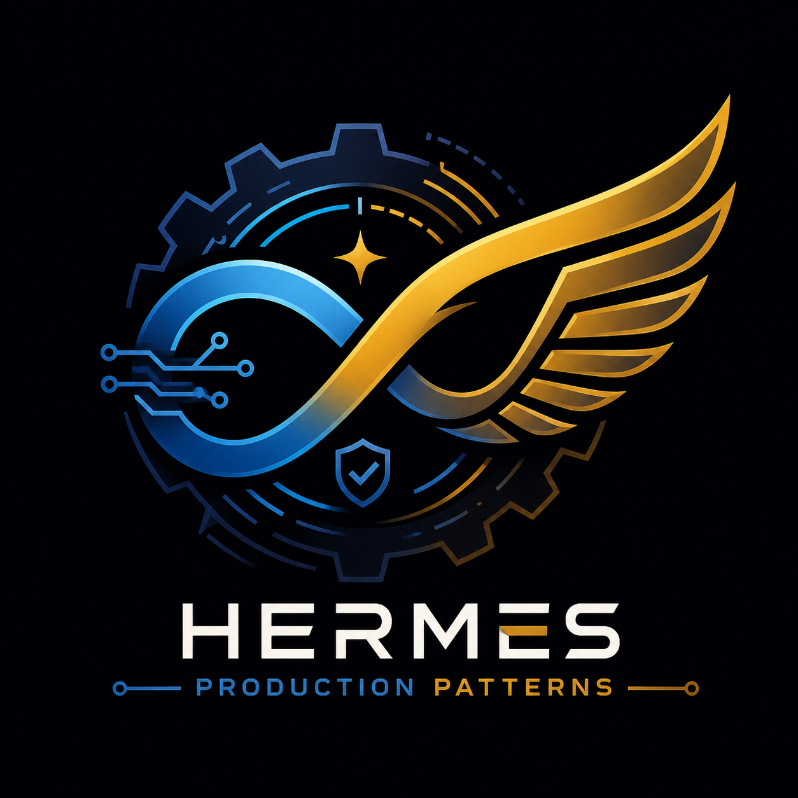

# Hermes Production Patterns

<p align="center">
  <picture>
    <source media="(prefers-color-scheme: dark)" srcset="assets/logo.png">
    
  </picture>
</p>

<p align="center">
  <a href="https://komagon.github.io/hermes-production-patterns/">
    
  </a>
  <a href="https://github.com/Komagon/hermes-production-patterns/actions/workflows/ci.yml">
    
  </a>
  <a href="TEST_REPORT.md">
    
  </a>
  <a href="LICENSE">
    
  </a>
  <a href="https://github.com/Komagon/hermes-production-patterns/stargazers">
    
  </a>
</p>

<p align="right">
  <a href="README.md">🇨🇳 中文</a>
</p>

> **A production engineering system for building reliable Hermes Agents.**
> Reliable. Observable. Recoverable. Evolvable.  \
> Built on Harness Engineering methodology + Loop Engineering + 12-Factor Agents

A complete set of engineering patterns, conventions, and templates to turn Hermes Agent from a "chat toy" into a "7×24 autonomous production system."

> 🚀 **v2.0.0 (2026-08-31) Productization Phase**: Upgraded from Pattern Library to Production Engineering System — **6 Starter Kits** (`starter-kits/`, just `cp -r` to start), **5 official Production Stacks** (`stacks/`, Opinionated Defaults), **10-Minute Quick Start** (`quickstart.md`), **7 Production Recipes** (`recipes/`, nine complete engineering solutions), **Production Audit spec + Readiness Score** (`audit/`), **Compatibility Matrix** (`compatibility/`), **hpp CLI** (`cli/`, init/add/validate/audit/doctor); Router 2.0 upgraded to Problem→Diagnosis question-based entry; site navigation reorganized into START HERE / BUILD / UNDERSTAND / VALIDATE. The core goal is no longer More Patterns — it is **MAKE PATTERNS USABLE.** See CHANGELOG v2.0.0.
> 🆕 **2026-09 — synced with the latest Hermes capabilities**: Browser automation (`browser_navigate`/`snapshot`/`click`/`vision`/`console`), messaging gateway (QQ official Bot via `platforms.qqbot`), multimodal output (`image_generate` for diagrams + `text_to_speech`), enhanced retrieval (`zg`/`hybrid_retrieve`, three-layer + RRF). Every capability has a verified run in a real environment (`examples/capability-verification-2026-09.md`), and the capability map is bumped to v1.4.0. See CHANGELOG v2.2.0.
>
> 🧪 **v2.3.2 (2026-09-07)**: Trace Engineering absorption — `control-flow-separation` v1.2.0 adds "tool-side effect annotation": static tool classification `READ_ONLY` (pure queries, safe to replay) / `MUTATING` (write ops, replay goes through sandbox + approval); `capability-registry.json` machine-readable (all 13 capabilities annotated with `side_effect`, 6 RO / 7 MU), preserved when `capability_probe.py` refreshes. This is the mechanical-layer landing of anti-patterns #13 "write rules twice" at the tool level.
>
> 🧪 **v2.3.1 (2026-09-07)**: `anti-patterns` v1.2.0 — anti-pattern catalog backfill items 10–12 (post-hoc skill loading / over-confirmation / flogging a dead horse) + new #13 "pure prompt constraints": hard rules relying only on prompts = default violation, correction = write rules twice (guide layer lets agent understand + mechanical layer makes agent unable to bypass: pre_tool_call interception / approval / enabled_toolsets / secret scanning).
>
> 🧪 **v2.3.0 (2026-09-07)**: Three X/GitHub project absorptions — ① `skill-evolution` v1.3.3: "hard gate discipline" (N/A separated from verification failure / cross-cutting skill mandatory gates / score capping) + "post-change auto-verification hook" (skill changes must run ①routing_check+capability_probe ②reverse-reference grep ③regression tests); ② `cron-job-pattern` v1.1.1: "frequency × reversibility task selection" (frequency / verifiable / reversible three thresholds); ③ `state-file-pattern` v1.1.1: "change receipt" (state + evidence + unresolved risk triple). See CHANGELOG v2.3.0.
>
> 🧠 **v1.03.00 (2026-08-20)**: Three new battle-tested patterns — Safe Self-Update (`self-update-pattern`, autostash pitfall + test-failure baseline), Memory OS (`memory-os-pattern`, five-layer memory + vector/graph/RRF + write discipline), Evolution Gate (`evolution-gate`, G1-G5 + five-dimension evaluation + regression loop). See CHANGELOG v1.03.00.
>
> 🧪 **v1.04.00 (2026-08-27)**: Added the regression test suite `test-prompts.json` (30 regression prompts covering 19 behavioral-contract patterns — `hermes-capability-map` is a reference mapping table, exempt; each with `assertions`/`forbidden`); `skill-evolution` bumped to v1.3.0 with built-in regression usage (when to run, how to run, rules for adding entries). Acceptance bar for any skill upgrade = old failures never return + old successes still hold. See CHANGELOG v1.04.00.

---

## Introduction

**Hermes Production Patterns** is a collection of production-grade engineering patterns for [Hermes Agent](https://github.com/NousResearch/hermes-agent).

You've installed Hermes. Now what? If you're struggling with:
- Writing reliable Skills that don't drift over time?
- Cron jobs that silently produce garbage?
- Agent output quality that requires constant human babysitting?
- Task state that evaporates the moment the session ends?
- Error traces that flood the context window and derail the agent?

This project is for you.

These aren't armchair best practices. Every pattern comes from real 7×24 production runs — tested across dozens of days and hundreds of triggers in content pipelines, news digest crons, and auto-update workflows — broken, fixed, and hardened into reusable conventions.

> **How to verify credibility?** This repo ships with [30 regression test prompts](test-prompts.json) (covering 19 behavioral-contract patterns) and a [STATE.md validation script](scripts/validate_state.py), all running in CI. Maturity levels: 🟢 battle-tested (long-term production verified) · 🟡 beta (being validated) · 🔵 experimental (reference/experimental).

---

## See a Pattern in 30 Seconds

Take **Error Compact** (`conventions/error-compact-pattern.md`) as an example — no setup needed, just before vs after:

**❌ Before (raw error floods the context window):**

```text
Error: ModuleNotFoundError: No module named "requests"
Traceback (most recent call last):
  File "/usr/lib/python3.11/runpy.py", line 196, in _run_module_as_main
    ...(30 lines of stack trace)
ModuleNotFoundError: No module named "requests"
```

**✅ After (compressed into a one-line structured summary):**

```text
[STEP_FAILED] fetch_data@2026-08-28T10:00:00
  Error: ModuleNotFoundError - "requests" package not installed
  Hint: pip install requests
  Recoverable: YES
```

> One pattern, one problem solved. All 20 conventions are in the `conventions/` directory.

## Why This Project

Hermes Agent is a powerful Agent framework, but what the community lacks most isn't "how to install Hermes" — it's:

- How to keep Cron jobs from drifting, duplicating, or silently failing?
- How to evolve from "hand-writing prompts" to "designing automated loops"?
- How to implement Maker/Checker separation?
- How to manage state across multiple agent tasks?
- How to handle errors without derailing the agent?
- When to use LLMs vs deterministic code?

**This project answers these questions.**

### How does it compare to existing solutions?

| Dimension | LangGraph / AutoGPT | Hermes Native | This Project (Hermes Production Patterns) |
|:---|:---|:---|:---|
| State Management | Built-in checkpoint API, framework-bound | `memory` tool (limited capacity, no structure) | **STATE.md text file**, zero dependencies, Git-trackable, readable in any editor |
| Error Handling | Framework-layer try/catch + retry | Agent handles it itself (easily derails) | **error-compact-pattern** compress → categorize → self-heal, context under control |
| Task Scheduling | External deps like Celery/Airflow | `cronjob_manage` native support | Idempotent + Monitor + Pre/Post-flight three-stage |
| Quality Assurance | Build your own eval pipeline | None built-in | **Maker/Checker + regression test suite** (30 test-prompts.json) |
| Memory System | Vector databases (heavy) | `memory` tool (light but unordered) | **Memory OS 5-layer architecture** + three-layer retrieval RRF |
| Install Complexity | Requires Python/Node env + dependencies | Already built-in | Text files, just `cp` and go |
| Use Cases | Large-scale Agent app development | Daily conversation and tasks | **Production-grade automation within the Hermes ecosystem** |

> **Positioning**: Not a replacement for heavy Agent frameworks, but a solution to Hermes ecosystem's unique "lightweight text-file-driven production engineering" problems. If you're using LangGraph, you don't need this project; if you're using Hermes and want it to work autonomously 24/7, this is what you need.

---

## Project Structure

```text
hermes-production-patterns/
├── AGENTS.md                    ← Harness entry point (AI read me)
├── README.md
├── quickstart.md                ← 10-Minute Quick Start (new in v2.0)
├── LICENSE                      ← MIT
├── config.yaml.example          ← Hermes config template
│
├── starter-kits/                ← 🚀 v2.0 Starter Kits (cp -r to start)
│   ├── basic-agent/             — Minimal runnable Agent (★)
│   ├── cron-production/         — Production-grade scheduled Agent (★★)
│   ├── maker-checker/           — Dual-role verification pipeline (★★)
│   ├── research-agent/          — Evidence-driven research (★★★)
│   ├── memory-agent/            — Five-layer memory system (★★★)
│   └── self-evolving-agent/     — Self-evolving loop (★★★★)
│
├── stacks/                      ← 🚀 v2.0 Official Recommended Stacks
│   ├── starter.md               — 🟢 SKILL + STATE + Control Flow
│   ├── reliable-automation.md   — 🟡 STATE + Cron + Error Compact + Checkpoint
│   ├── quality.md               — 🔵 Maker + Checker + Red Flags + Regression
│   ├── memory.md                — 🟣 Memory OS + Evidence + Retrieval + Review
│   └── evolution.md             — 🔴 Metrics + Gate + Regression + Deploy/Rollback
│
├── recipes/                     ← 🚀 v2.0 Complete Engineering Recipes (all nine sections)
│   ├── daily-news-agent.md
│   ├── content-pipeline.md
│   ├── research-pipeline.md
│   ├── autonomous-monitor.md
│   ├── coding-agent-pipeline.md
│   ├── knowledge-agent.md
│   └── multi-agent-workflow.md
│
├── audit/                       ← 🚀 v2.0 Production Audit
│   ├── audit.md                 — Audit spec (Pattern Evidence)
│   ├── checks/checklist.md      — 15-item behavioral checklist
│   └── scoring/readiness-score.md — Five-dimension weighted 100-point scale
│
├── compatibility/               ← 🚀 v2.0 Compatibility Matrix
│   ├── README.md
│   └── hermes-versions.yaml     — Machine-readable, referenced by CLI audit
│
├── cli/                         ← 🚀 v2.0 hpp CLI
│   ├── hpp.py                   — init / add / validate / audit / doctor
│   └── README.md
│
├── conventions/                 ← Engineering conventions (core output, 20 patterns)
│   ├── maker-checker.md         — Generate / verify dual-role separation
│   ├── state-file-pattern.md    — STATE.md cross-run state management
│   ├── control-flow-separation.md — Deterministic vs LLM control flow
│   ├── error-compact-pattern.md — Error compression, classification & self-heal
│   ├── skill-evolution.md       — Skill versioning & lifecycle management
│   ├── cron-job-pattern.md      — Cron idempotency & silent-failure prevention
│   ├── checkpoint-pattern.md    — Long-running task checkpoint recovery
│   ├── secret-management.md     — Secret storage & rotation
│   ├── anti-patterns.md         — 💡 Anti-patterns & corrections
│   ├── pattern-composition.md   — 🧩 Scenario→pattern decision tree
│   ├── state-schema.json        — 📐 STATE.md JSON Schema (programmatic validation)
│   ├── pattern-schema.json      — 📐 Pattern frontmatter JSON Schema
│   ├── trace-schema.json        — 📐 Decision trace log JSON Schema
│   ├── data-driven-optimization.md — 📊 Data-driven skill iteration from real analytics
│   ├── hermes-capability-map.md — 🗺️ Hermes capability × pattern mapping (2026-08)
│   ├── self-update-pattern.md   — 🔄 Safe self-update workflow
│   ├── memory-os-pattern.md     — 🧠 Cognitive memory system
│   ├── evolution-gate.md        — 📈 Evolution gate
│   ├── budget-guardrail.md      — 💰 Cost guardrail (three-tier response)
│   ├── human-escalation.md      — 🆙 Human-in-the-loop escalation
│   ├── multi-agent-isolation.md — 🔒 Multi-agent collaboration isolation
│   ├── observability-trace.md   — 👁️ Decision tracing
│   └── data-retention-privacy.md — 🛡️ Data retention & privacy
│
├── templates/                   ← Reusable file templates
│   ├── SKILL.md.template
│   ├── STATE.md.template
│   └── AGENTS.md.template
│
├── patterns/                    ← Design patterns & methodology
│   ├── loop-engineering-14-steps.md
│   ├── 12-factor-agents-for-hermes.md
│   ├── maturity-staging-l1-l2-l3.md
│   └── maturity-checklist.md
│
├── examples/                    ← Complete real-world examples
│   ├── daily-news-digest.md
│   ├── maker-checker-article-pipeline.md
│   ├── cron-safety-integration.md
│   ├── wechat-article-pipeline.md   — WeChat writing + AI detection + diagram pipeline
│   ├── minimal-demo/                — 🆕 5-Minute Minimal Demo
│   └── failures/                    — 🆕 Real failure case studies (Hall of Shame)
│
├── scripts/                     ← Utility scripts
│   ├── validate_state.py        — STATE.md Schema validation
│   ├── run_regression.py        — Regression test runner (generates TEST_REPORT.md)
│   ├── lint.js                  — 🆕 Pattern Linter (SKILL.md/STATE.md checks)
│   ├── doctor.py                — 🆕 Pattern recommendation engine (interactive Q&A)
│   └── ...
│
├── TEST_REPORT.md               ← Regression test report (auto-generated by CI)
├── DOCTOR_REPORT.md             — 🆕 Doctor recommendation report (generated at runtime)
│
```

---

## Three Design Principles

### 1. Harness Engineering — The Repository is the Source of Truth

The repo itself is a Harness Engineering case study. `AGENTS.md` is the entry point for any AI reading your project. Each `conventions/` file is an executable skill. Templates are instantiable prototypes.

### 2. Loop Engineering — From Prompts to Systems

Don't hand-write every prompt. Design an **autonomous loop**: discover work → dispatch to agent → verify result → record state → decide next move.

### 3. 12-Factor Agents — Reliability by Design

Each engineering principle maps to a concrete decision:
- Factor 2 → Write SKILL.md, not ad-hoc prompts
- Factor 5 → Use STATE.md for unified state
- Factor 7 → Maker/Checker dual-role separation
- Factor 8 → Control flow separation (code vs LLM)
- Factor 9 → Error compaction, not context explosion

---

## Quick Start

### 0. 10-Minute Quick Start (Recommended)

Follow [quickstart.md](quickstart.md): in 10 minutes, get a stateful, verifiable, schedulable Production Agent. Or use the hpp CLI for one-command setup:

```bash
git clone https://github.com/Komagon/hermes-production-patterns.git
cd hermes-production-patterns
cli/hpp init basic-agent ~/my-agent
cli/hpp doctor   # Environment diagnosis
```

### 0.1 Minimal Demo (5 Minutes to See the Value)

Don't want to set up the environment? Run this script directly and see STATE.md auto-update in 5 minutes:

```bash
python examples/minimal-demo/demo_cron.py
# Open reports/STATE.md to see state changes
# Run again to observe idempotent skip
```

See [examples/minimal-demo/](examples/minimal-demo/) for details.

### 1. Install Patterns into Your Hermes

All `conventions/` files include standard Hermes Skill YAML frontmatter and can be installed directly:

```bash
# Clone the project
git clone https://github.com/Komagon/hermes-production-patterns.git
cd hermes-production-patterns

# One-command copy conventions to Hermes skills directory (each stays in its own subdirectory)
mkdir -p ~/.hermes/skills/hermes-production-patterns
cp -r conventions/* ~/.hermes/skills/hermes-production-patterns/
cp -r templates/ ~/.hermes/skills/hermes-production-patterns/
cp AGENTS.md ~/.hermes/skills/hermes-production-patterns/
```

After installation, reload Hermes (new sessions take effect automatically, run `/reload-skills` in the current session), then use `/skill` to load:

```bash
# In a Hermes session
/reload-skills
/skill maker-checker    # Load Maker/Checker convention
/skill state-file-pattern  # Load state management convention
```

```powershell
# Windows (PowerShell) — same operation
New-Item -ItemType Directory -Force -Path "$env:USERPROFILE\.hermes\skills\hermes-production-patterns"
Copy-Item -Recurse -Path conventions\* -Destination "$env:USERPROFILE\.hermes\skills\hermes-production-patterns\"
Copy-Item -Recurse -Path templates\* -Destination "$env:USERPROFILE\.hermes\skills\hermes-production-patterns\templates\"
Copy-Item AGENTS.md -Destination "$env:USERPROFILE\.hermes\skills\hermes-production-patterns\"
```

### 2. Create Your First Skill from a Template

```bash
# Linux / macOS
mkdir -p ~/.hermes/skills/my-skill
cp templates/SKILL.md.template ~/.hermes/skills/my-skill/SKILL.md
```

```powershell
# Windows (PowerShell)
New-Item -ItemType Directory -Force -Path "$env:USERPROFILE\AppData\Local\hermes\skills\my-skill"
Copy-Item templates\SKILL.md.template "$env:USERPROFILE\AppData\Local\hermes\skills\my-skill\SKILL.md"
```

### 3. Add STATE.md to Your Cron Job

```bash
mkdir -p reports/my-cron-job
cp templates/STATE.md.template reports/my-cron-job/STATE.md
```

```powershell
New-Item -ItemType Directory -Force -Path "reports\my-cron-job"
Copy-Item templates\STATE.md.template "reports\my-cron-job\STATE.md"
```

### 4. Configure Your Hermes with config.yaml.example

```bash
cp config.yaml.example ~/.hermes/config.yaml
# Replace YOUR_xxx_HERE with your actual API keys
```

---

## Environment Variables

| Variable | Purpose | Required |
|:---|:---|:---:|
| `HERMES_API_KEY` | Hermes API authentication | Yes |
| `OPENAI_API_KEY` / `ANTHROPIC_API_KEY` | LLM provider | Depends on provider |
| `FAL_KEY` | Image generation (FAL.ai) | Optional |
| `MINERU_API_KEY` | PDF parsing (MinerU) | Optional |
| `GITHUB_TOKEN` | GitHub API operations | Optional (auto-injected in CI) |

```bash
# Linux / macOS
export HERMES_API_KEY="your-key-here"

# Windows (PowerShell)
$env:HERMES_API_KEY = "your-key-here"
```

---

## Quick Reference

Maturity levels: 🟢 battle-tested (long-term production verified) · 🟡 beta (being validated) · 🔵 experimental (reference/experimental)

| Concept | File | One-liner | Maturity |
|:---|:---|:---|:---:|
| Maker/Checker | `conventions/maker-checker.md` | The agent that writes and the agent that verifies are never the same | 🟢 |
| STATE.md | `conventions/state-file-pattern.md` | Read state before run, write state after every step | 🟢 |
| Control Flow Separation | `conventions/control-flow-separation.md` | Use code for anything expressible as a rule, not LLM | 🟡 |
| Error Compaction & Self-heal | `conventions/error-compact-pattern.md` | Compress errors to one line, categorize, then attempt self-heal | 🟢 |
| Skill Evolution | `conventions/skill-evolution.md` | Skills have versions, lifecycles, and migration paths | 🟡 |
| Cron Job Design | `conventions/cron-job-pattern.md` | Idempotent + silent-failure prevention + native Monitor mode (only burn tokens on change) | 🟢 |
| Checkpoint Recovery | `conventions/checkpoint-pattern.md` | Long-running tasks can resume from checkpoints | 🟡 |
| Secret Management | `conventions/secret-management.md` | Secrets stay out of Git, context, and logs | 🔵 |
| 💡 Anti-patterns | `conventions/anti-patterns.md` | 8 common error practices and their corrections | 🔵 |
| 🧩 Pattern Composition | `conventions/pattern-composition.md` | Scenario→pattern decision tree + maturity mapping | 🔵 |
| 📐 State Schema | `conventions/state-schema.json` | STATE.md JSON Schema for programmatic validation | — |
| Loop Engineering | `patterns/loop-engineering-14-steps.md` | Check if it's worth building, then design it right | — |
| Maturity Staging | `patterns/maturity-staging-l1-l2-l3.md` | L1 reports only → L2 assisted → L3 autonomous | — |
| 12-Factor Map | `patterns/12-factor-agents-for-hermes.md` | 12 engineering principles mapped to Hermes | — |
| 🗺️ Capability Map | `conventions/hermes-capability-map.md` | Map new Hermes capabilities onto existing patterns (2026-08) | 🔵 |
| 🔄 Safe Self-Update | `conventions/self-update-pattern.md` | Snapshot before update → verify stash after update → test baseline → rollback | 🟡 |
| 🧠 Memory OS | `conventions/memory-os-pattern.md` | Five-layer memory + three-layer retrieval (vector/graph/RRF) + write discipline | 🟡 |
| 📈 Evolution Gate | `conventions/evolution-gate.md` | G1-G5 five-gate + five-dimension weighted evaluation + regression Deploy/Rollback | 🟡 |
| 📊 Data-Driven Optimization | `conventions/data-driven-optimization.md` | Drive skill iteration from real operational data | 🟡 |
| 💰 Cost Guardrail | `conventions/budget-guardrail.md` | Three-tier budget response (warn/throttle/circuit-break) to prevent token overruns | 🔵 |
| 🆙 Human Escalation | `conventions/human-escalation.md` | Escalate to human oversight for high-risk / low-confidence situations | 🔵 |
| 🔒 Multi-Agent Isolation | `conventions/multi-agent-isolation.md` | Namespace / file locks / token buckets to prevent resource contention | 🔵 |
| 👁️ Decision Tracing | `conventions/observability-trace.md` | Structured logging of decision chains, confidence, and alternatives | 🔵 |
| 🛡️ Data Privacy | `conventions/data-retention-privacy.md` | Sensitive data detection, retention periods, auto-cleanup | 🔵 |

---

## References & Credits

### Core Frameworks

| Project | Description |
|:---|:---|
| [Hermes Agent](https://github.com/NousResearch/hermes-agent) — Nous Research | The self-evolving AI Agent framework this project builds upon |
| [12-Factor Agents](https://github.com/humanlayer/12-factor-agents) — HumanLayer | The original definition of 12 engineering principles, a theoretical cornerstone of this project |
| [Loop Engineering](https://x.com/0xCodez/status/2064374643729773029) — @0xCodez (Lev Deviatkin, Anthropic) | The original X Article for the 14-step Loop roadmap, 6000+ likes |
| [Harness Engineering](https://github.com/garrytan/gbrain/blob/master/docs/ethos/THIN_HARNESS_FAT_SKILLS.md) — garrytan | Agent reliable execution methodology course, guiding the architectural design of this project |

### Extended Reading

| Resource | Description |
|:---|:---|
| [Addy Osmani — Loop Engineering](https://addyosmani.com/blog/loop-engineering/) | Systematic article on loop engineering, complementary to the 14-step roadmap |
| [AlphaSignal — 4-Condition Test](https://alphasignalai.substack.com/p/most-developers-do-not-need-agent) | "Most developers don't need agent loops yet" — a pre-condition judgment criterion |
| [Anthropic — Recursive Self-Improvement](https://www.anthropic.com/institute/recursive-self-improvement) | Research on the boundaries of agent self-improvement |
| [Geoffrey Huntley — Agentic Loop Failures](https://ghuntley.com/loop/) | Case studies of agent loop failures in production |
| [CB Insights — AI Agent Bible](https://www.cbinsights.com/research/report/ai-agents-bible/) | 69-page AI Agent landscape report |
| [Google Cloud — AI Agent Trends 2026](https://cloud.google.com/resources/content/ai-agent-trends-2026) | Enterprise agent deployment trends report |

### Document Mapping

| File | Based On |
|:---|:---|
| `conventions/maker-checker.md` | 12-Factor Agents Factor 7 + Loop Engineering Step 9 |
| `conventions/state-file-pattern.md` | 12-Factor Agents Factor 5 + Loop Engineering Step 10 |
| `conventions/control-flow-separation.md` | 12-Factor Agents Factor 8 |
| `conventions/error-compact-pattern.md` | 12-Factor Agents Factor 9 |
| `conventions/cron-job-pattern.md` | 12-Factor Agents Factor 6 + cron-scheduler production experience |
| `conventions/checkpoint-pattern.md` | 12-Factor Agents Factor 12 + Hermes checkpoint mechanism |
| `conventions/secret-management.md` | 12-Factor Agents Factor 4 (config separation) + Hermes `.env` practice |
| `conventions/skill-evolution.md` | skill-creator + Hermes curator practice |
| `patterns/loop-engineering-14-steps.md` | @0xCodez Loop Engineering X Article |
| `patterns/12-factor-agents-for-hermes.md` | HumanLayer 12-Factor Agents |
| `patterns/maturity-staging-l1-l2-l3.md` | cron-scheduler + task-safety production experience |

---

## Prerequisites

- [Hermes Agent](https://github.com/NousResearch/hermes-agent) v0.6+
- Obsidian (optional, for knowledge management)
- Git (for versioning skill files)

---

## License

MIT — free to use, modify, and distribute.

## Contributing

PRs and Issues welcome. Core principle: **every pattern must have been validated in a production environment** — purely theoretical designs are not accepted.
