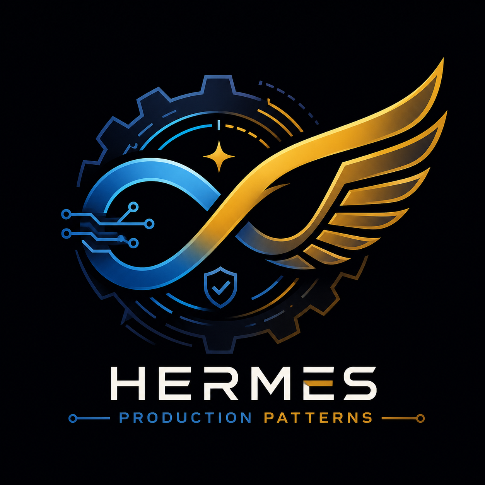

# Hermes Production Patterns

<p align="center">
  <picture>
    <source media="(prefers-color-scheme: dark)" srcset="assets/logo.png">
    
  </picture>
</p>

<p align="center">
  <a href="https://komagon.github.io/hermes-production-patterns/">
    
  </a>
  <a href="https://github.com/Komagon/hermes-production-patterns/actions/workflows/ci.yml">
    
  </a>
  <a href="TEST_REPORT.md">
    
  </a>
  <a href="LICENSE">
    
  </a>
  <a href="https://github.com/Komagon/hermes-production-patterns/stargazers">
    
  </a>
</p>

<p align="right">
  <a href="README.en.md">🇬🇧 English</a>
</p>

> **A production engineering system for building reliable Hermes Agents.**
> Reliable. Observable. Recoverable. Evolvable.  \
> Built on Harness Engineering methodology + Loop Engineering + 12-Factor Agents

把 Hermes Agent 从「聊天玩具」变成「7x24 小时自主工作的生产系统」所需的全部工程模式、公约和模板。

> 🚀 **v2.0.0（2026-08-31）Productization Phase**：从 Pattern Library 升级为 Production Engineering System——新增 **6 个 Starter Kits**（`starter-kits/`，cp -r 开跑）、**5 个官方 Production Stacks**（`stacks/`，Opinionated Defaults）、**10-Minute Quick Start**（`quickstart.md`）、**7 个 Production Recipes**（`recipes/`，九节齐全的完整工程方案）、**Production Audit 规范 + Readiness Score**（`audit/`）、**兼容性矩阵**（`compatibility/`）、**hpp CLI**（`cli/`，init/add/validate/audit/doctor）；Router 2.0 升级为 Problem→Diagnosis 问题式入口；网站导航重组为 START HERE / BUILD / UNDERSTAND / VALIDATE。核心不再是 More Patterns，而是 **MAKE PATTERNS USABLE.** 详见 CHANGELOG v2.0.0。
> 🆕 **2026-08 已同步 Hermes 最新能力**：Monitor 原生监控（哈希抑制，变了才烧 token）、delegate Checker（独立子代理 + schema 契约）、能力×模式映射表（`conventions/hermes-capability-map.md`）。详见 CHANGELOG v1.02.00。
>
> 🧠 **v1.03.00（2026-08-20）**：新增 3 个实战模式——自更新安全流程（`self-update-pattern`，autostash 坑 + 测试失败基线）、Memory OS（`memory-os-pattern`，五层记忆 + 向量/图谱/RRF + 写侧纪律）、进化闸门（`evolution-gate`，G1-G5 + 五维评估 + 回归闭环）。详见 CHANGELOG v1.03.00。
>
> 🧪 **v1.04.00（2026-08-27）**：新增回归反测集 `test-prompts.json`（25 条回归提示词，覆盖 14 个行为契约模式——`hermes-capability-map` 为参考映射表不设反测；每条含 assertions/forbidden）；`skill-evolution` 升级 v1.3.0 并内置反测用法（何时跑、怎么跑、新增条目规则）。技能升级验收标准 = 旧失败不再出现 + 旧成功仍然成立。详见 CHANGELOG v1.04.00。

---

## 简介 · Introduction

### 中文

**Hermes Production Patterns** 是一套面向 [Hermes Agent](https://github.com/NousResearch/hermes-agent) 的生产级工程模式集。

如果你已经装好了 Hermes，但发现：
- 不知道怎么写一个「靠谱」的技能（Skill）？
- Cron 任务跑着跑着就跑偏了，没人发现？
- Agent 输出质量不稳定，全靠肉眼审查？
- 多个任务的状态全靠脑子记，一重启就断片？
- 错误一出来就把上下文炸了，Agent 直接失焦？

这个项目就是为你准备的。

它不是什么「最佳实践」大合集。每一条模式都来自真实的 7x24 运行环境——在运行数十天、数百次触发的公众号流水线、新闻摘要 Cron、自动更新等场景中反复验证，踩过坑，打过补丁，最终沉淀为可复用的工程公约。

> **如何验证可信度？** 本项目附带 [25 条回归反测提示词](test-prompts.json)（覆盖 14 个行为契约模式）和 [STATE.md 校验脚本](scripts/validate_state.py)，CI 自动运行。成熟度分级：🟢 battle-tested（长期生产验证）· 🟡 beta（验证中）· 🔵 experimental（参考性）。

### English

**Hermes Production Patterns** is a collection of production-grade engineering patterns for [Hermes Agent](https://github.com/NousResearch/hermes-agent).

You've installed Hermes. Now what? If you're struggling with:

- Writing reliable Skills that don't drift over time
- Cron jobs that silently produce garbage
- Agent output quality that requires constant human babysitting
- Task state that evaporates the moment the session ends
- Error traces that flood the context window and derail the agent

This project is for you.

These aren't armchair best practices. Every pattern comes from real 7x24 production runs — tested across dozens of days and hundreds of triggers in content pipelines, news digest crons, and auto-update workflows — broken, fixed, and hardened into reusable conventions.

> **How to verify credibility?** This repo ships with [25 regression test prompts](test-prompts.json) (covering 14 behavioral contract patterns) and a [STATE.md validation script](scripts/validate_state.py), all running in CI. Maturity levels: 🟢 battle-tested · 🟡 beta · 🔵 experimental.

---

## 30 秒看懂一个模式

以**错误压缩**（`conventions/error-compact-pattern.md`）为例——不用装环境，改前 vs 改后一目了然：

**❌ 改前（原始错误直接塞上下文）：**

```text
Error: ModuleNotFoundError: No module named "requests"
Traceback (most recent call last):
  File "/usr/lib/python3.11/runpy.py", line 196, in _run_module_as_main
    ...（30 行堆栈）
ModuleNotFoundError: No module named "requests"
```

**✅ 改后（压缩成一行结构化摘要）：**

```text
[STEP_FAILED] fetch_data@2026-08-28T10:00:00
  Error: ModuleNotFoundError - "requests" 包未安装
  Hint: pip install requests
  Recoverable: YES
```

> 一个模式解决一个问题。全部 20 个公约见 `conventions/` 目录。

## 为什么需要这个项目

Hermes Agent 本身是一个强大的 Agent 框架，但社区里最缺的不是「怎么装 Hermes」，而是：

- 怎么让 Cron 任务不跑偏、不重复、不静默失败？
- 怎么从「手写提示词」进化到「设计自动化的 Loop」？
- Maker/Checker 分离怎么做？
- 多个 Agent 任务的状态怎么管理？
- 错误来了怎么处理，不让 Agent 失焦？
- 什么时候用 LLM，什么时候用确定性代码？

**这个项目回答的就是这些问题。**

### 和现有方案有什么区别？

|| 对比维度 | LangGraph / AutoGPT | Hermes 原生能力 | 本项目（Hermes Production Patterns） |
||:---|:---|:---|:---|
|| 状态管理 | 内置 checkpoint API，框架绑定 | `memory` 工具（容量有限，无结构） | **STATE.md 文本文件**，零依赖、Git 可追踪、任何编辑器可读 |
|| 错误处理 | 框架层 try/catch + retry | Agent 自行处理（容易失焦） | **error-compact-pattern** 压缩→分类→自愈，上下文可控 |
|| 任务调度 | Celery/Airflow 等外部依赖 | `cronjob_manage` 原生支持 | 幂等+Monitor+Pre/Post-flight 三段式 |
|| 质量保障 | 需自建 eval pipeline | 无内置 | **Maker/Checker + 回归反测集**（25 条 test-prompts.json） |
|| 记忆体系 | 向量数据库（重） | `memory` 工具（轻但无序） | **Memory OS 五层架构** + 三层检索 RRF |
|| 安装复杂度 | 需要 Python/Node 环境 + 依赖 | 已内置 | 文本文件，cp 即用 |
|| 适用场景 | 大型 Agent 应用开发 | 日常对话和任务 | **Hermes 生态内的生产级自动化** |

> **定位**：不是重型 Agent 框架的替代品，而是解决 Hermes 生态特有的「轻量文本文件驱动的生产工程」问题。如果你用的是 LangGraph，你不需要这个项目；如果你用的是 Hermes 且想让它 7x24 自主工作，这就是你需要的。

---

## 项目结构

```text
hermes-production-patterns/
├── AGENTS.md                    ← Harness 入口（AI 读我）
├── README.md
├── quickstart.md                ← 10-Minute Quick Start（v2.0 新增）
├── LICENSE                      ← MIT
├── config.yaml.example          ← Hermes 配置模板
│
├── starter-kits/                ← 🚀 v2.0 起步套件（cp -r 开跑）
│   ├── basic-agent/             — 最小可运行 Agent（★）
│   ├── cron-production/         — 定时生产级 Agent（★★）
│   ├── maker-checker/           — 双角色验证流水线（★★）
│   ├── research-agent/          — 证据驱动研究（★★★）
│   ├── memory-agent/            — 五层记忆体系（★★★）
│   └── self-evolving-agent/     — 自进化闭环（★★★★）
│
├── stacks/                      ← 🚀 v2.0 官方推荐组合
│   ├── starter.md               — 🟢 SKILL + STATE + Control Flow
│   ├── reliable-automation.md   — 🟡 STATE + Cron + Error Compact + Checkpoint
│   ├── quality.md               — 🔵 Maker + Checker + Red Flags + Regression
│   ├── memory.md                — 🟣 Memory OS + Evidence + Retrieval + Review
│   └── evolution.md             — 🔴 Metrics + Gate + Regression + Deploy/Rollback
│
├── recipes/                     ← 🚀 v2.0 完整工程方案（九节齐全）
│   ├── daily-news-agent.md
│   ├── content-pipeline.md
│   ├── research-pipeline.md
│   ├── autonomous-monitor.md
│   ├── coding-agent-pipeline.md
│   ├── knowledge-agent.md
│   └── multi-agent-workflow.md
│
├── audit/                       ← 🚀 v2.0 生产审计
│   ├── audit.md                 — 审计规范（Pattern Evidence）
│   ├── checks/checklist.md      — 15 项行为检查单
│   └── scoring/readiness-score.md — 五维加权 100 分制
│
├── compatibility/               ← 🚀 v2.0 兼容性矩阵
│   ├── README.md
│   └── hermes-versions.yaml     — 机器可读,CLI 审计引用
│
├── cli/                         ← 🚀 v2.0 hpp CLI
│   ├── hpp.py                   — init / add / validate / audit / doctor
│   └── README.md
│
├── conventions/                 ← 工程公约（核心产出，20 个 pattern）
│   ├── maker-checker.md         — 生成/验证双角色分离
│   ├── state-file-pattern.md    — STATE.md 跨运行状态管理
│   ├── control-flow-separation.md — 确定性 vs LLM 控制流
│   ├── error-compact-pattern.md — 错误压缩、分类与自愈
│   ├── skill-evolution.md       — 技能版本化与生命周期管理
│   ├── cron-job-pattern.md      — Cron 任务幂等、防静默失败
│   ├── checkpoint-pattern.md    — 长任务检查点恢复
│   ├── secret-management.md     — 密钥存放与轮换规范
│   ├── anti-patterns.md         — 💡 反面模式与纠正方案
│   ├── pattern-composition.md   — 🧩 场景→模式组合决策树
│   ├── state-schema.json        — 📐 STATE.md JSON Schema（程序校验用）
│   ├── pattern-schema.json      — 📐 Pattern frontmatter JSON Schema
│   ├── trace-schema.json        — 📐 决策追溯日志 JSON Schema
│   ├── data-driven-optimization.md — 📊 用真实运营数据驱动技能迭代
│   ├── hermes-capability-map.md — 🗺️ Hermes 能力 × 生产模式映射（2026-08）
│   ├── self-update-pattern.md   — 🔄 自更新安全流程
│   ├── memory-os-pattern.md     — 🧠 认知记忆系统
│   ├── evolution-gate.md        — 📈 进化闸门
│   ├── budget-guardrail.md      — 💰 成本护栏（三级响应）
│   ├── human-escalation.md      — 🆙 人工介入升级
│   ├── multi-agent-isolation.md — 🔒 多 Agent 协作隔离
│   ├── observability-trace.md   — 👁️ 决策追溯
│   └── data-retention-privacy.md — 🛡️ 数据保留与隐私
│
├── templates/                   ← 可复用的文件模板
│   ├── SKILL.md.template
│   ├── STATE.md.template
│   └── AGENTS.md.template
│
├── patterns/                    ← 设计模式与方法论
│   ├── loop-engineering-14-steps.md
│   ├── 12-factor-agents-for-hermes.md
│   ├── maturity-staging-l1-l2-l3.md
│   └── maturity-checklist.md
│
├── examples/                    ← 完整实战示例
│   ├── daily-news-digest.md
│   ├── maker-checker-article-pipeline.md
│   ├── cron-safety-integration.md
│   ├── wechat-article-pipeline.md   — 公众号写作+AI检测+配图流水线
│   ├── minimal-demo/                — 🆕 5 分钟极简 Demo
│   └── failures/                    — 🆕 真实失败案例复盘（Hall of Shame）
│
├── scripts/                     ← 工具脚本
│   ├── validate_state.py        — STATE.md Schema 校验
│   ├── run_regression.py        — 回归测试运行器（生成 TEST_REPORT.md）
│   ├── lint.js                  — 🆕 Pattern Linter（SKILL.md/STATE.md 检查）
│   ├── doctor.py                — 🆕 Pattern 推荐引擎（交互式问答）
│   └── ...
│
├── TEST_REPORT.md               ← 回归测试报告（CI 自动生成）
├── DOCTOR_REPORT.md             — 🆕 doctor 推荐报告（运行时生成）
│
```

---

## 三大设计原则

### 1. Harness Engineering — 仓库即真理之源

整个项目本身就是 Harness 的落地案例。`AGENTS.md` 是 AI 读你的切入点，每个 `conventions/` 文件是可执行的技能，模板是可实例化的原型。

### 2. Loop Engineering — 从提示词到系统设计

不是手写每一条 Prompt，而是设计一个**自主循环**：接任务 → 派给 Agent → 验证结果 → 记录状态 → 决策下一步。

### 3. 12-Factor Agents — 可靠性的十二条守则

每一条原则对应一个具体的工程决策：
- Factor 2 → 写 SKILL.md 不写临时 Prompt
- Factor 5 → 用 STATE.md 统一状态
- Factor 7 → Maker/Checker 双角色
- Factor 8 → 控制流分离（代码 vs LLM）
- Factor 9 → 错误压缩不炸锅

---

## 快速开始

### 0. 10-Minute Quick Start（推荐）

跟 [quickstart.md](quickstart.md) 走：10 分钟内得到一个带状态、可验证、能定时运行的 Production Agent。也可以用 hpp CLI 一键起步：

```bash
git clone https://github.com/Komagon/hermes-production-patterns.git
cd hermes-production-patterns
cli/hpp init basic-agent ~/my-agent
cli/hpp doctor   # 环境诊断
```

### 0.1 极简 Demo（5 分钟看懂价值）

不想装环境？直接跑这个脚本，5 分钟看到 STATE.md 自动更新：

```bash
python examples/minimal-demo/demo_cron.py
# 打开 reports/STATE.md 看状态变化
# 再跑一次，观察幂等跳过
```

详见 [examples/minimal-demo/](examples/minimal-demo/)。

### 1. 把模式装进你的 Hermes

所有 `conventions/` 文件已包含 Hermes Skill 标准的 YAML frontmatter，可直接安装：

```bash
# clone 项目
git clone https://github.com/Komagon/hermes-production-patterns.git
cd hermes-production-patterns

# 一键复制 conventions 到 Hermes skills 目录（保持各自独立子目录）
mkdir -p ~/.hermes/skills/hermes-production-patterns
cp -r conventions/* ~/.hermes/skills/hermes-production-patterns/
cp -r templates/ ~/.hermes/skills/hermes-production-patterns/
cp AGENTS.md ~/.hermes/skills/hermes-production-patterns/
```

安装后重新加载 Hermes（新会话自动生效，当前会话运行 `/reload-skills`），然后即可用 `/skill` 加载：

```bash
# 在 Hermes 会话中
/reload-skills
/skill maker-checker    # 加载 Maker/Checker 公约
/skill state-file-pattern  # 加载状态管理公约
```

```powershell
# Windows (PowerShell) 同样操作
New-Item -ItemType Directory -Force -Path "$env:USERPROFILE\.hermes\skills\hermes-production-patterns"
Copy-Item -Recurse -Path conventions\* -Destination "$env:USERPROFILE\.hermes\skills\hermes-production-patterns\"
Copy-Item -Recurse -Path templates\* -Destination "$env:USERPROFILE\.hermes\skills\hermes-production-patterns\templates\"
Copy-Item AGENTS.md -Destination "$env:USERPROFILE\.hermes\skills\hermes-production-patterns\"
```

### 2. 用模板创建你的第一个技能

```bash
# Linux / macOS
mkdir -p ~/.hermes/skills/my-skill
cp templates/SKILL.md.template ~/.hermes/skills/my-skill/SKILL.md
```

```powershell
# Windows (PowerShell)
New-Item -ItemType Directory -Force -Path "$env:USERPROFILE\AppData\Local\hermes\skills\my-skill"
Copy-Item templates\SKILL.md.template "$env:USERPROFILE\AppData\Local\hermes\skills\my-skill\SKILL.md"
```

### 3. 为你的 Cron 任务添加 STATE.md

```bash
mkdir -p reports/my-cron-job
cp templates/STATE.md.template reports/my-cron-job/STATE.md
```

```powershell
New-Item -ItemType Directory -Force -Path "reports\my-cron-job"
Copy-Item templates\STATE.md.template "reports\my-cron-job\STATE.md"
```

### 4. 参考 config.yaml.example 配置你的 Hermes

```bash
cp config.yaml.example ~/.hermes/config.yaml
# 替换 YOUR_xxx_HERE 为你的真实 API Key
```

---

## 环境变量

| 变量 | 用途 | 必填 |
|:---|:---|:---:|
| `HERMES_API_KEY` | Hermes API 认证 | 是 |
| `OPENAI_API_KEY` / `ANTHROPIC_API_KEY` | LLM 服务商 | 取决于服务商 |
| `FAL_KEY` | 图片生成 (FAL.ai) | 可选 |
| `MINERU_API_KEY` | PDF 解析 (MinerU) | 可选 |
| `GITHUB_TOKEN` | GitHub API 操作 | 可选 (CI 自动注入) |

```bash
# Linux / macOS
export HERMES_API_KEY="your-key-here"

# Windows (PowerShell)
$env:HERMES_API_KEY = "your-key-here"
```

---

## 核心概念速查

成熟度说明：🟢 battle-tested（长期生产验证）· 🟡 beta（验证中）· 🔵 experimental（参考/实验性）

|| 概念 | 文件 | 一句话 | 成熟度 |
||:---|:---|:---|:---:|
|| Maker/Checker | `conventions/maker-checker.md` | 写代码的 Agent 和验证的 Agent 不是同一个 | 🟢 |
|| STATE.md | `conventions/state-file-pattern.md` | 每次运行先读状态，每步执行后写状态 | 🟢 |
|| 控制流分离 | `conventions/control-flow-separation.md` | 能用代码的别用 LLM | 🟡 |
|| 错误压缩与自愈 | `conventions/error-compact-pattern.md` | 错误压成一行，分类后尝试自愈 | 🟢 |
|| 技能进化 | `conventions/skill-evolution.md` | 技能有版本、有生命周期、有迁移路径 | 🟡 |
|| Cron 任务设计 | `conventions/cron-job-pattern.md` | 幂等+防静默失败+原生 Monitor 模式（变了才烧 token） | 🟢 |
|| 检查点恢复 | `conventions/checkpoint-pattern.md` | 长任务挂了能从检查点续跑 | 🟡 |
|| 密钥管理 | `conventions/secret-management.md` | 密钥不进 Git、不进上下文、不落日志 | 🔵 |
|| 💡 反面模式 | `conventions/anti-patterns.md` | 8 种常见错误实践及纠正 | 🔵 |
|| 🧩 模式组合 | `conventions/pattern-composition.md` | 场景→模式决策树+成熟度映射 | 🔵 |
|| 📐 状态 Schema | `conventions/state-schema.json` | STATE.md 的 JSON Schema 程序校验 | — |
|| Loop Engineering | `patterns/loop-engineering-14-steps.md` | 先判断值不值得做，再设计怎么做 | — |
|| 成熟度分级 | `patterns/maturity-staging-l1-l2-l3.md` | L1 只报告 → L2 辅助 → L3 自动 | — |
|| 12-Factor 对照 | `patterns/12-factor-agents-for-hermes.md` | 12 条工程原则的 Hermes 落地映射 | — |
|| 🗺️ 能力映射 | `conventions/hermes-capability-map.md` | Hermes 新能力对号入座到既有模式（2026-08） | 🔵 |
|| 🔄 自更新安全 | `conventions/self-update-pattern.md` | 更新前快照 → 更新后验 stash → 测试基线 → 可回滚 | 🟡 |
|| 🧠 Memory OS | `conventions/memory-os-pattern.md` | 五层记忆 + 三层检索（向量/图谱/RRF）+ 写侧纪律 | 🟡 |
|| 📈 进化闸门 | `conventions/evolution-gate.md` | G1-G5 五闸门 + 五维加权评估 + 回归 Deploy/Rollback | 🟡 |
|| 📊 数据驱动优化 | `conventions/data-driven-optimization.md` | 用真实运营数据驱动技能迭代 | 🟡 |
|| 💰 成本护栏 | `conventions/budget-guardrail.md` | 三级预算响应（预警/降级/熔断）防止 token 失控 | 🔵 |
|| 🆙 人工介入 | `conventions/human-escalation.md` | 高风险/低置信度时升级到人工兜底 | 🔵 |
|| 🔒 多 Agent 隔离 | `conventions/multi-agent-isolation.md` | 命名空间/文件锁/令牌桶防止资源竞争 | 🔵 |
|| 👁️ 决策追溯 | `conventions/observability-trace.md` | 结构化日志记录决策链路、置信度、备选方案 | 🔵 |
|| 🛡️ 数据隐私 | `conventions/data-retention-privacy.md` | 敏感信息检测、保留期限、自动清理 | 🔵 |

---

## 引用与致谢

### 核心框架

| 项目 | 说明 |
|:---|:---|
| [Hermes Agent](https://github.com/NousResearch/hermes-agent) — Nous Research | 本项目所基于的自进化 AI Agent 框架 |
| [12-Factor Agents](https://github.com/humanlayer/12-factor-agents) — HumanLayer | 12 条工程原则的原始定义，本项目的理论基石之一 |
| [Loop Engineering](https://x.com/0xCodez/status/2064374643729773029) — @0xCodez (Lev Deviatkin, Anthropic) | 14 步 Loop 路线图的原始 X Article，6000+ likes |
| [Harness Engineering](https://github.com/garrytan/gbrain/blob/master/docs/ethos/THIN_HARNESS_FAT_SKILLS.md) — garrytan | Agent 可靠执行方法论课程，本项目架构设计的指导思想 |

### 延伸参考

| 资源 | 说明 |
|:---|:---|
| [Addy Osmani — Loop Engineering](https://addyosmani.com/blog/loop-engineering/) | Loop Engineering 的体系化文章，与 14 步路线图互补 |
| [AlphaSignal — 4-Condition Test](https://alphasignalai.substack.com/p/most-developers-do-not-need-agent) | 「大部分开发者还不该用 Agent Loop」—— 前置判断标准 |
| [Anthropic — Recursive Self-Improvement](https://www.anthropic.com/institute/recursive-self-improvement) | Agent 自我改进的边界研究 |
| [Geoffrey Huntley — Agentic Loop Failures](https://ghuntley.com/loop/) | 生产环境 Agent Loop 失败的案例研究 |
| [CB Insights — AI Agent Bible](https://www.cbinsights.com/research/report/ai-agents-bible/) | AI Agent 产业全景报告（69页） |
| [Google Cloud — AI Agent Trends 2026](https://cloud.google.com/resources/content/ai-agent-trends-2026) | 企业 Agent 部署趋势报告 |

### 本项目中的关联文档

| 文件 | 引用来源 |
|:---|:---|
| `conventions/maker-checker.md` | 12-Factor Agents Factor 7 + Loop Engineering Step 9 |
| `conventions/state-file-pattern.md` | 12-Factor Agents Factor 5 + Loop Engineering Step 10 |
| `conventions/control-flow-separation.md` | 12-Factor Agents Factor 8 |
| `conventions/error-compact-pattern.md` | 12-Factor Agents Factor 9 |
| `conventions/cron-job-pattern.md` | 12-Factor Agents Factor 6 + cron-scheduler 实战 |
| `conventions/checkpoint-pattern.md` | 12-Factor Agents Factor 12 + Hermes checkpoint 机制 |
| `conventions/secret-management.md` | 12-Factor Agents Factor 4（配置分离）+ Hermes `.env` 实践 |
| `conventions/skill-evolution.md` | skill-creator + Hermes curator 实践 |
| `patterns/loop-engineering-14-steps.md` | @0xCodez Loop Engineering X Article |
| `patterns/12-factor-agents-for-hermes.md` | HumanLayer 12-Factor Agents |
| `patterns/maturity-staging-l1-l2-l3.md` | cron-scheduler + task-safety 实践经验 |

---

## 先决条件

- [Hermes Agent](https://github.com/NousResearch/hermes-agent) v0.6+
- Obsidian（可选，用于知识管理）
- Git（用于版本化技能文件）

---

## 许可

MIT — 自由使用、修改、分发。

## 贡献

PR 和 Issues 都欢迎。核心原则：**每条模式必须在生产环境中验证过**，不接受纯理论设计。
